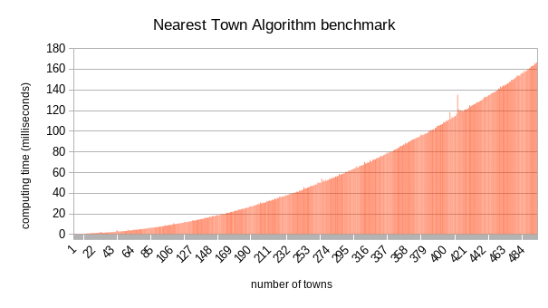

# Parcours de graphe

On prends le fameux [travelling salesman problem](https://en.wikipedia.org/wiki/Travelling_salesman_problem) et on implémente le problème en python.

## Brute force

1. Entrer via input() le nombre de villes
2. créer le graphe des n villes avec un dictionnaire

   - chaque nom de ville est une clé du dictionnaire
   - chaque valeur est un tuple de coordonnées(x,y)

3. Implémenter l'algorithme de parcours de graphe pour déterminer tous les chemins possibles en comptant le temps écoulé entre le début et la fin de l'algorithme avec la fonction `perf_counter_ns()`
4. Afficher le temps écoulé puis la liste de tous les chemins une fois le programme terminé
5. Exécuter le programme en augmentant `n` et observer **le temps d'exécution**. Utilisez un tableur pour représenter l'évolution de `t` en fonction de `n`. _Quelle relation mathématique relie `n` et `t` de sorte que `t = f(n)` ?_

### La récursivité 

Il fat faire une fonction récursive  du genre `parcourirLesVillesRestantes` qui deep-copiera la liste des villes restantes (ne pas muter en global !). Elle aura en paramètres:

- la ville où l'on se trouve
- une liste de villes parcourues (le chemin).
- une liste de villes non explorées

### Faire un beau graphe

Pour donner les données à libreoffice ou à excel on fait un csv qui s'appelle `times.csv`.

## La ville la plus proche

Cet algorithme ne trouve pas le chemin le plus court, mais un chemin raisonablement court. Il nécessite surtout beaucoup moins d'opération.

